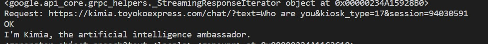
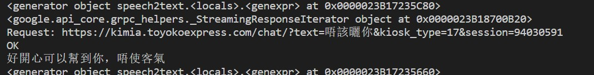

# PhoneCall_Voicebots_SIM800C

The program implements the Voicebots with Phone Call using ATK-SIM800C GSM/GPRS Module. Natural TTS will be integrated to facilitate advanced features. This project covers lots of scopes, like serial programming, multithreading, audio processing, and NLP-related features supported by Google Cloud Platform (GCP).

## Getting started
In order to use Python Client for Cloud Text-to-Speech API, you ought to go through the following steps:

1. [Select or create a Cloud Platform project.](https://console.cloud.google.com/project)
2. [Enable billing for your project.](https://cloud.google.com/billing/docs/how-to/)
3. [Enable the Cloud Text-to-Speech API.](https://cloud.google.com/texttospeech)
4. [Setup Authentication.](https://googleapis.dev/python/google-api-core/latest/auth.html)

After that, you can do

<pre><code>from google.cloud import texttospeech
from google.cloud import speech
</code></pre>

### Installing

Given multiple APIs may be used, it is recommended to have a pre-project environment when developing locally with Python. Install this library in a [virtualenv](https://virtualenv.pypa.io/en/latest/) using pip, if you haven't done it before. virtualenv is a tool to create isolated Python environments. The basic problem it addresses is one of dependencies and versions, and indirectly permissions.

With virtualenv, it's possible to install this library without needing system install permissions, and without clashing with the installed system dependencies.

For more installing details, please refer to [this](https://github.com/googleapis/python-texttospeech).

Install other packages if needed. 

### NLP-related features

Apart from calling function, it provides basic MP3 playing function, and audio recording. As for advanced NLP-related features that enable it to interact with the users, it includes

>1. Convert a text file to mp3/wav format utilizing GCP API, and vice versa, by transcribing streaming audio from a microphone.
>2. Integrate with the ready-made interface, and make it able to better identify some specific terms from the user's voice, irrespective of the language. 
>3. Languages should preferably include English, Cantonese and Mandarin. When the user speaks one kind of language, it should reply in the same language. 

Those are achieved with the help of [GCP API](https://cloud.google.com), including texttospeech and speech.  

### Demo

## License

This project is licensed under the MIT License - see the [LICENSE](LICENSE) file for details

## Reference
[google-cloud-speech](https://pypi.org/project/google-cloud-speech/)

[google.oauth2.service_account module](https://google-auth.readthedocs.io/en/master/reference/google.oauth2.service_account.html)

[YouTube 1](https://www.youtube.com/watch?v=ZXnPMzmrmIY)

[YouTube 2](https://www.youtube.com/watch?v=lKra6E_tp5U&list=PL3JVwFmb_BnQlc47zGPQFzrKeyXiolAoS)

As for the issue of testing ATK-SIM800C GSM/GPRS Module, please use XCOM V2.0 and, if necessary, RTFM :satisfied:
